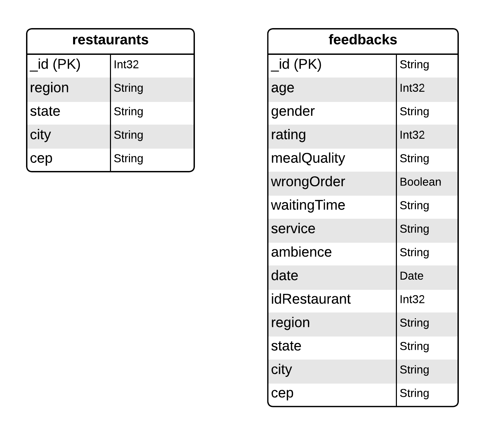

# Sistema de Feedback de Franquia de Restaurantes

<!-- TOC -->
* [Sistema de Feedback de Franquia de Restaurantes](#sistema-de-feedback-de-franquia-de-restaurantes)
  * [💻 Sobre o projeto](#-sobre-o-projeto)
    * [Microsserviços](#microsserviços)
    * [Comunicação e Armazenamento](#comunicação-e-armazenamento)
    * [Resiliência e Monitoramento](#resiliência-e-monitoramento)
    * [Testes](#testes)
    * [Diagrama Banco de dados MongoDB](#diagrama-banco-de-dados-mongodb)
  * [⚙️ Funcionalidades](#-funcionalidades)
  * [Como executar o projeto](#como-executar-o-projeto)
    * [Pré-requisitos](#pré-requisitos)
    * [Passos](#passos)
    * [🐳 Docker](#-docker)
  * [Testar aplicação](#testar-aplicação)
  * [🛠 Tecnologias](#-tecnologias)
  * [🦸 Autor](#-autor)
  * [📝 Licença](#-licença)
<!-- TOC -->

## 💻 Sobre o projeto

Este projeto de back-end Java é construído com Spring Boot e implementa uma arquitetura de microsserviços para coletar e analisar feedbacks de clientes de uma franquia de restaurantes. 
O sistema é projetado para processar formulários de feedback e fornecer análises estatísticas para insights operacionais e estratégicos.

### Microsserviços

O sistema é composto por cinco microsserviços principais:

1. **Gateway**: Atua como um ponto de entrada para as requisições, direcionando-as para os serviços apropriados.
2. **Eureka**: Serve como um servidor de descoberta de serviços, mapeando todos os microsserviços disponíveis.
3. **FeedbacksCollector**: API que recebe feedbacks dos clientes e os encaminha para o serviço FeedbacksStorage.
4. **FeedbacksStorage**: Responsável por armazenar os feedbacks recebidos no banco de dados MongoDB e realização de
   análises.
5. **FeedbacksAnalysis**: API que processa solicitações de análise dos feedbacks. As análises podem ser baseadas em
   critérios como região, idade ou personalizadas, utilizando qualquer parâmetro do formulário.

### Comunicação e Armazenamento

- A comunicação entre os serviços FeedbacksCollector, FeedbacksStorage e FeedbacksAnalysis é realizada de forma
  assíncrona através do Apache Kafka.
- O serviço FeedbacksStorage utiliza o cache Redis para armazenar resultados de análises. Isso permite que análises com
  os mesmos parâmetros sejam recuperadas rapidamente sem a necessidade de recalculá-las.

### Resiliência e Monitoramento

- O Gateway utiliza o Circuit Breaker para os serviços FeedbacksCollector e FeedbacksAnalysis, garantindo que sistema
  não sobrecarregue mesmo em caso de falhas nos microsserviços.
- Métricas e traces são visualizados graficamente através do Grafana, proporcionando uma visão clara do desempenho e
  saúde do sistema.

### Testes

- Testes foram realizados nos serviços na camada de Service utilizando JUnit 5 e Mockito.

### Diagrama Banco de dados MongoDB


## ⚙️ Funcionalidades

- Enviar feedback com base em um restaurante selecionado, avaliando os seguintes itens:
    - Nota de 1 a 10 da experiência
    - Qualidade da refeição
    - Se o pedido veio conforme esperado
    - Tempo de espera
    - Atendimento
    - Ambiente
        - Além disso, é preciso incluir a idade e gênero para análises mais detalhadas

- Solicitar análises dos feedbacks tendo como referência:
    - Região
        - Os feedbacks são separados pelas regiões do Brasil (Norte, Nordeste, Centro-Oeste, Sudeste e Sul)
        - Pode receber um intervalo de datas para parametrizar os feedbacks selecionados
    - Idade
        - Os feedbacks são separados por grupos de idades (16-24, 25-35, 36-50, 51-70 e 71-110)
        - Pode receber um intervalo de datas para parametrizar os feedbacks selecionados
    - Personalizado
        - A análise pode receber os seguintes parâmetros, podendo ser combinados:
            - Intervalo de datas
            - Intervalo de idades
            - Intervalo de notas
            - Região
            - Gênero
            - Qualidade da refeição
            - Se o pedido veio conforme esperado
            - Tempo de espera
            - Atendimento
            - Ambiente

## Como executar o projeto

### Pré-requisitos

- JDK
- Maven
- Docker
- Git

### Passos

1. Clonar repositório

````
$ git clone https://github.com/matheus1629/restaurant-franchise-feedback.git
````

2. Inicializar containers do Kafka, Mongo e Redis

````
docker run -d --name my-kafka -p 9092:9092 apache/kafka:3.7.0
docker run -d --name my-mongodb -p 27017:27017 mongo:7.0.7
docker run -d --name my-redis -p 6379:6379 redis:7.2.4
````

3. Criar os arquivos .jar para os microsserviços. No diretório de cada microsserviço executar

````
mvn package
````

4. Executar os arquivos .jar de cada microsserviço (Seguir a ordem de execução)

````
# O servidor inciará na porta:8070
java -jar eurekaserver/target/eurekaserver-0.0.1-SNAPSHOT.jar

# O servidor inciará na porta:8080
java -jar feedbackscollector/target/feedbackscollector-0.0.1-SNAPSHOT.jar

java -jar feedbacksstorage/target/feedbacksstorage-0.0.1-SNAPSHOT.jar

# O servidor inciará na porta:8081
java -jar feedbacksanalysis/target/feedbacksanalysis-0.0.1-SNAPSHOT.jar

# O servidor inciará na porta:8072
java -jar gatewayserver/target/gatewayserver-0.0.1-SNAPSHOT.jar
````

Para fins de testes, durante a inicialização do microsserviço feedbacksstorage, serão criadas no mongoDB as
coleções `restaurants` com 50 documentos e `feedbacks` com 500 documentos.
Os dados dos documentos da coleção `feedbacks` são gerados de forma aleatória.

### 🐳 Docker

Para inicializar o projeto em containers:

- Executar `mvn compile jib:dockerBuild` em cada microsserviço para criar sua imagem.
- No diretório **docker-compose/default/** executar `docker-compose up` para rodar o projeto em containers.

## Testar aplicação

Após inicializar os microsserviços, estes podem ser testados pelo swagger ou postman:

- Swagger
    - Microsserviço feedbackscollector: http://localhost:8080/swagger-ui/index.html
    - Microsserviço feedbacksanalysis: http://localhost:8081/swagger-ui/index.html
- Postman
    - [Restaurant_Feedback.postman_collection.json](doc%2FRestaurant_Feedback.postman_collection.json)

## 🛠 Tecnologias

As seguintes ferramentas foram usadas na construção do projeto:

- Java 17
- Spring Boot
- Spring Cloud
- MongoDB
- Swagger
- Kafka
- Mockito
- Redis
- Grafana

## 🦸 Autor

<a href="https://github.com/matheus1629">
 
 <br />
 <sub><b>Matheus Palermo</b></sub></a>
 <br />

[](https://www.linkedin.com/in/matheus-palermo/)

## 📝 Licença

Este projeto esta sob  licença [MIT](./LICENSE).

 
